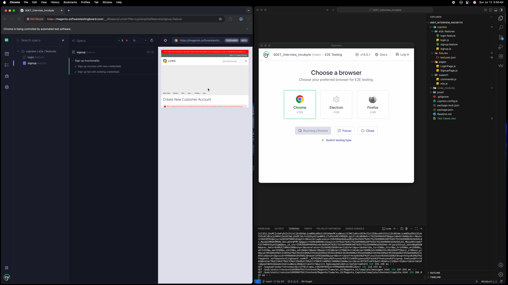

# Incubyte Automation Assessment – Sign Up & Login Flow

## Overview

This project contains automation test scripts for verifying the **Sign Up** and **Login** functionality of [Magento](https://magento.softwaretestingboard.com/) as part of the Incubyte Software Developer in Testing (SDET) assignment.

The test cases are written using:
- **Cypress**
- **Cucumber/Gherkin (BDD)**
- **Page Object Model (POM)**
- **Fixtures** to persist test data between scenarios

---
## Proof & Test Cases Document
 - Video - https://drive.google.com/file/d/1uc7chhY3jItIobgzuZuYvIEpZyLc-QfQ/view?usp=sharing
 - Excel - https://docs.google.com/spreadsheets/d/1Opx5XFaoeXzsspXXBZ6DEnV__R65gms0Qf1iUZPFGdg/edit?usp=sharing
---
## 📸 Proof of Execution

### ✅ Sign Up Test

### ✅ Login Test

---
## 📁 Project Structure
<pre>
cypress/
├── e2e/
│ └── features/
│ ├── signup.feature # BDD Feature for Sign Up
│ ├── signup.js # Step definitions for Sign Up
│ ├── login.feature # BDD Feature for Login
│ └── login.js # Step definitions for Login
├── pages/
│ └── SignupPage.js # Page Object for signup form
│ └── LoginPage.js # Page Object for login form
├── fixtures/
│ └── testuser.json # Stores test email/password for login reuse
├── support/
│ └── e2e.js # Cucumber setup
├── proof/
│ └── Login-Test-Screenshot.png
│ └── Sign-Up-Test-Screenshot.png
cypress.config.js
Test Cases.xlsx
package.json
README.md
</pre>
---

## 🚀 Setup Instructions

 - Clone Repo
 - npm install
 - npx cypress open
 - npx cypress run (headless CLI)